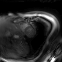
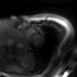

# spspiral-cest

*Code for cardiac CEST (with spatial-spectral saturation) using VD spiral readouts in Pulseq*

  

## Instructions

To use these sequences on your scanner (with and without spatial-spectral saturation pulses), follow the instructions below.

1. Clone the repository to your machine using `git clone https://github.com/jweigandwhittier/spspiral-cest`
2. Set up a [Conda](https://www.anaconda.com/docs/getting-started/miniconda/main) environment using the included `environment.yml` file
   * Navigate to your `spspiral-cest` directory
   * Run `conda env create -f environment.yml`
     * Two environment files are included (`environment.yml` and `environment_legacy.yml`) — see the [**Environments**](#environments) section below for details
   * Activate the environment with `conda activate spspiral-cest`
3. Write a .seq file using [continuous_spiral.py](continuous_spiral.py)
   * The script contains various flags, which should be set based on the user's preferences. CEST prep and readout parameters can also be changed, but the sequence may no longer work as designed.
     * To write a generic SPSP pulse (e.g., an SPSP pulse with no gradients, only the spectral envelope and subpulse design) use `FLAG_GENERIC`
     * To use a tailored SPSP pulse (e.g., for inhomogeneous B1), a corresponding B1 map is required. This can be either a DICOM (Siemens or GE) or an .npy file with a corresponding .seq file with defined matrix size and FOV.
4. Deploy the .seq file on the scanner and acquire images (details coming soon)!
5. Reconstruct images using [recon_core.py](recon_core.py)
     * After images are reconstructed from raw data, MTasym or Z-spectra can be reconstructed using [recon_mtrasym_example.py](recon_mtr_asym_example.py) and [recon_zspec_example.py](recon_zspec_example.py) respectively

## Environments

Two environments are included in this repository (`environment.yml` and `environment_legacy.yml`).

For general use, libraries should be installed using the default `environment.yml` file. This file installs a PyPulseq v1.5.1 fork by [@mcencini](https://github.com/mcencini) which includes an implementation of the rotation extension (see [pulseq/pypulseq#184](https://github.com/pulseq/pypulseq/discussions/184) and [pulseq/pulseq#117](https://github.com/pulseq/pulseq/discussions/117)). This extension is *required* to use this sequence on GE scanners due to memory constraints, and is the preferred way to implement sequences with gradient rotation for Pulseq versions ≥v1.5.0. For more information regarding sequence design constraints on GE hardware, please reference the [pge2 design rules](https://github.com/HarmonizedMRI/SequenceExamples-GE/blob/main/pge2/docs/pge2-sequence-design-rules.md).

If you are using an *older* interpreter sequence (v1.4.2) on a Siemens scanner, this rotation extension will not work correctly. In this case, install libraries using `environment_legacy.yml`. Here, gradient rotations are calculated manually in the loop and sequences are written using [PyPulseq v1.4.2post1](https://github.com/pulseq/pypulseq/releases#release-v1.4.2.post1).

## GE Specifics

[@jfnielsen](https://github.com/jfnielsen) and the rest of the GE Pulseq team have done an incredible job designing and implementing the GE Pulseq interpreter sequence. Due to hardware constraints inherent to the GE platform, a few extra steps are required to get this sequence running correctly on GE scanners.

### Orchestra SDK

The Orchestra SDK is required to reconstruct raw data from GE scanners. If your site has an active research agreement with GE, the easiest way to obtain this is through a GE Healthcare enterprise GitHub account, which grants access to [a private GitHub repo](https://github.com/GEHC-External/MR-Orchestra-SDK-Python) where the SDK can be downloaded.

### MATLAB Engine

pge2 requires an active MATLAB installation. Here, we call the required MATLAB functions in Python using the [MATLAB Engine API](https://www.mathworks.com/help/matlab/matlab_external/install-the-matlab-engine-for-python.html). This should be installed *separately* using pip depending on the version of MATLAB you have installed. 

Check the indexed versions of MATLAB Engine using:

`pip index versions matlabengine`

And install the one matching your MATLAB version number (e.g., for MATLAB R2025a):

`pip install matlabengine==25.1.2`

### Pulseg and pge2

A Pulseq .seq file must be converted to the pge2 format before it can be run on GE hardware. This is a multi-step process requiring source code for both [pge2](https://github.com/HarmonizedMRI/pge2/tree/main) and [Pulseg](https://github.com/HarmonizedMRI/pulseg). Both of these repositories should cloned in *this repository's parent directory*. 

This repository contains a script to automatically convert a sequence to the pge2 format when it is written: [LINK FILE HERE]. This is an example script, and several site-specific parameters *must* be changed before it is used. **Please read the comments carefully**.

This script also writes a Shell script to automatically deploy the .pge2 file and an associated .entry file on the scanner. For more information regarding Pulseq for GE, please refer to the excellent [GE Pulseq interpreter wiki](https://github.com/GEHC-External/pulseq-ge-interpreter/wiki).

## References
* [Ayala C, Luo H, Godines K, et al. Individually tailored spatial–spectral pulsed CEST MRI for ratiometric mapping of myocardial energetic species at 3T. Magnetic Resonance in Med. 2023;90(6):2321-2333. doi:10.1002/mrm.29801](https://pubmed.ncbi.nlm.nih.gov/37526176/)
* [Layton KJ, Kroboth S, Jia F, et al. Pulseq: A rapid and hardware-independent pulse sequence prototyping framework: Rapid Hardware-Independent Pulse Sequence Prototyping. Magn Reson Med. 2017;77(4):1544-1552. doi:10.1002/mrm.26235](https://onlinelibrary.wiley.com/doi/full/10.1002/mrm.26235)
* [Nielsen J, Noll DC. TOPPE: A framework for rapid prototyping of MR pulse sequences. Magnetic Resonance in Med. 2018;79(6):3128-3134. doi:10.1002/mrm.26990](https://onlinelibrary.wiley.com/doi/full/10.1002/mrm.26990)
* [Herz K, Mueller S, Perlman O, et al. Pulseq‐CEST: Towards multi‐site multi‐vendor compatibility and reproducibility of CEST experiments using an open‐source sequence standard. Magnetic Resonance in Med. 2021;86(4):1845-1858. doi:10.1002/mrm.28825](https://pubmed.ncbi.nlm.nih.gov/33961312/)
* [Liebeskind A, Schüre JR, Fabian MS, et al. The Pulseq-CEST Library: definition of preparations and simulations, example data, and example evaluations. Magn Reson Mater Phy. 2025;38(3):413-422. doi:10.1007/s10334-025-01242-6](https://link.springer.com/article/10.1007/s10334-025-01242-6)
